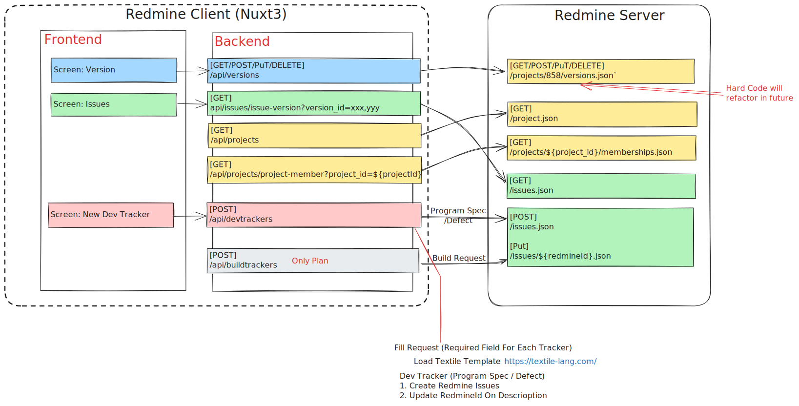

# Simple Redmine Client

* A simple redmine client to manange redmine data via REST API https://www.redmine.org/projects/redmine/wiki/Rest_api
* Develop with Nuxt3 + vuetify + TypeScript

# Overview Architecture



# Feature

- [x] List Versions (On Specific Project Id)
- [x] List Issue from versions 
- [x] New Dev Tracker (Program Spec / Defect)
- [x] Set your own access Token
- [ ] New Build Tracker (Build Request)
- [ ] Add Unit Test (Initial)

# Plan List

- Add Coverage Report
- Add Component Test
- Add API Test
- Refactor Code eq. remove hardcode to config such as List Versions (On Specific Project Id) / Tracker Template with some hardcode id of custom field

# Nuxt Minimal Starter

Look at the [Nuxt documentation](https://nuxt.com/docs/getting-started/introduction) to learn more.

## Setup

Make sure to install dependencies:

```bash
# npm
npm install

# pnpm
pnpm install

# yarn
yarn install

# bun
bun install
```

## Development Server

Start the development server on `http://localhost:3000`:

```bash
# npm
npm run dev

# pnpm
pnpm dev

# yarn
yarn dev

# bun
bun run dev
```

## Production

Build the application for production:

```bash
# npm
npm run build

# pnpm
pnpm build

# yarn
yarn build

# bun
bun run build
```

Locally preview production build:

```bash
# npm
npm run preview

# pnpm
pnpm preview

# yarn
yarn preview

# bun
bun run preview
```

Check out the [deployment documentation](https://nuxt.com/docs/getting-started/deployment) for more information.

## Use Lib

```
bun add vuetify vite-plugin-vuetify sass
bun add axios
```

## Build & Run

```
docker build --pull -t bun-redmine:0.3.0rc10 .

docker build --pull -t bun-redmine:0.3.0rc10 . --no-cache --progress=plain 

docker run -d -p 3000:3000 --env-file .\.env --name bun-redmine bun-redmine:0.3.0rc10

docker tag bun-redmine:0.3.0rc10 pingkunga/bun-redmine:0.3.0rc10
docker push pingkunga/bun-redmine:0.3.0rc10
```

## Test

```
bun add -d vitest @vitest/ui @vue/test-utils jsdom

bun test
```